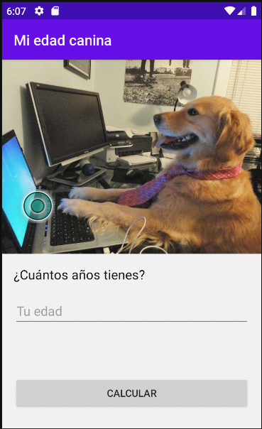

# Mi edad canina

Con esta app hemos aprendido los siguientes temas sobre Android:
- Android Views.
- ImageViews - Incluye imágenes en tus apps.
- Implementar views con findViewById en Kotlin.
- OnClickListener.
- Logcat.
- Logging con Android.
- Toasts.
- Recursos String.
- Como crear apps multi lenguajes.
- Data Binding.
- Como insertar y cambiar el ícono de la app.
- Qué es el Android Manifest.
- Tipos de Layouts.

Así luce la app terminada:




### Instalación

Instala la aplicación con los siguientes pasos:

**Paso 1: Clona el repo**

Usa esto en tu terminal para clonar tu repositorio:
```bash
git clone https://github.com/Mgobeaalcoba/android_app_mi_edad_canina_kotlin.git
```
También puedes descargarla como Zip en caso de que aún no sepas usar Git & Github

**Paso 2: Abre el proyecto en Android Studio **

Abre Android Studio y selecciona "Open project". Luego busca en tu directorio donde clonaste (o descargaste y descomprimiste) el proyecto.
Selecciona la carpeta raiz del mismo y dale aceptar. Listo! Ya estás en el proyecto. Y puedas ver como está compuesto. Sus archivos Kotlin 
para armar la lógica de la app. Sus archivos XML para ver el layout y el diseño de cada Activity.

**Paso 3: Ejecuta el proyecto y revisa que funcione correctamente**

Abre el proyecto en Android Studio y ejecútalo con el botón "run". Previamente debes tener creado un dispositivo de emulación o en su defecto emparejado un dispositivo físico Android donde puedas instalar y luego ejecutar la app.

Proximamente en Play Store!!!

Developer: Mariano Gobea Alcoba <gobeamariano@gmail.com>
