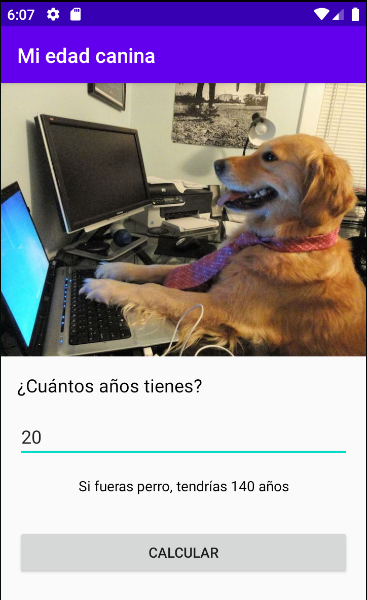

# Mi edad canina

Con esta app hemos aprendido los siguientes temas sobre Android:
- Android Views.
- ImageViews - Incluye imágenes en tus apps.
- Implementar views con findViewById en Kotlin.
- OnClickListener.
- Logcat.
- Logging con Android.
- Toasts.
- Recursos String.
- Como crear apps multi lenguajes.
- Data Binding.
- Como insertar y cambiar el ícono de la app.
- Qué es el Android Manifest.
- Tipos de Layouts.

Así luce la app terminada:




### Instalación

Instala la aplicación con los siguientes pasos:

**Paso 1: Clona el repo**

Usa esto en tu terminal para clonar tu repositorio:
```bash
git clone https://github.com/Mgobeaalcoba/android_app_mi_edad_canina_kotlin.git
```
También puedes descargarla como Zip

**Paso 2: Has checkout al branch ‘starter’ **

El proyecto tiene dos branches: starter es para que tú mismo(a) desarrolles la app y master es la app ya terminada, para
trabajar con uno u otro escribe lo siguiente en la terminal
```bash
git checkout starter
```
El branch de starter solo mostrará un texto "Hello world" en una pantalla blanca.

**Paso 3: Ejecuta el proyecto y revisa que funcione correctamente**

Abre el proyecto en Android Studio y ejecútalo con el botón "run"
